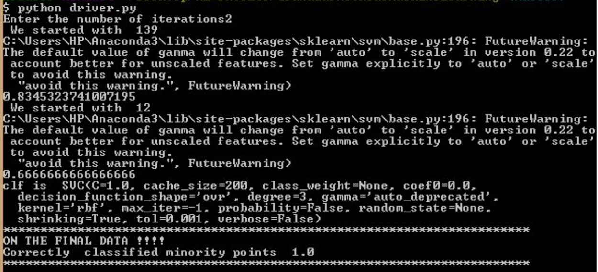

# GranularMethodsMachineLearning
Implement granular methods in machine learning

## Description of Dataset
### Labels
  - Benign=0
  - Malignant=1

### Features
  - BI-RADS assessment: 1 to 5 (ordinal)  
  - Age: patient's age in years (integer) 
  - Shape: mass shape: (nominal)
      - round=1 
      - oval=2 
      - lobular=3 
      - irregular=4 
  - Margin: mass margin: (nominal)
      - circumscribed=1 
      - microlobulated=2 
      - obscured=3 
      - ill-defined=4 
      - spiculated=5 
  - Density: mass density (ordinal)
      - high=1 
       - iso=2 
       - low=3 
       - fat-containing=4 
  - Severity: (binominal)
       - benign=0
       - malignant=1 

## Preprocessing
Eliminate null values with the help of forward fill
Create bins based on the age of the women, into 5 bins according to the data range

## Modules
- read_data : Has a function that reads data from a text file and preprocesses the data, which it returns to a pandas dataframe.
- make_granule: 
Runs decision tree on the data to make granules.
Choose the mode amongst all the points present in the granule
Return this data along with the corresponding labels
- svm(): 
 Run the svm algorithm on the data sent by make_granule and return the decision boundary and support vectors.
Remove those granules that lie on the decision boundary.
- driver(): the function that runs all the modules in order.

## Implementation
Successfully implemented granularization with the help of decision trees.
We then chose the mode amongst the points present in the granule.
We then run svm on the granules.
Remove those granules that lie on the support vector from the majority class.
Repeat the first three steps till we hit the upper bound on the number of steps or minority class misclassification is 0.
Results
We were able to get a perfect classification of the minority class dataset for cancer.  
( http://archive.ics.uci.edu/ml/datasets/mammographic+mass )

## CONCLUSION
The class imbalance problem is a major problem, that is present within a large number of datasets. This problems cannot be solved by the models alone, thus, we make use of specialized techniques that make the training models immune to these imbalances within the dataset. The technique that we are working on focuses on creating granules of the input data and then running training models, so as to prune borderline cases and improve the performance on the minority class.

This algorithm purposely under fits the data, so that we do not bias based on the majority class. Thus, we may have a lower accuracy overall, but a higher accuracy for the minority class.

## Contact the Authors
- Tanmay Kulkarni (f20150647@hyderabad.bits-pilani.ac.in)
- Somya Sharma (f20160216@hyderabad.bits-pilani.ac.in)
